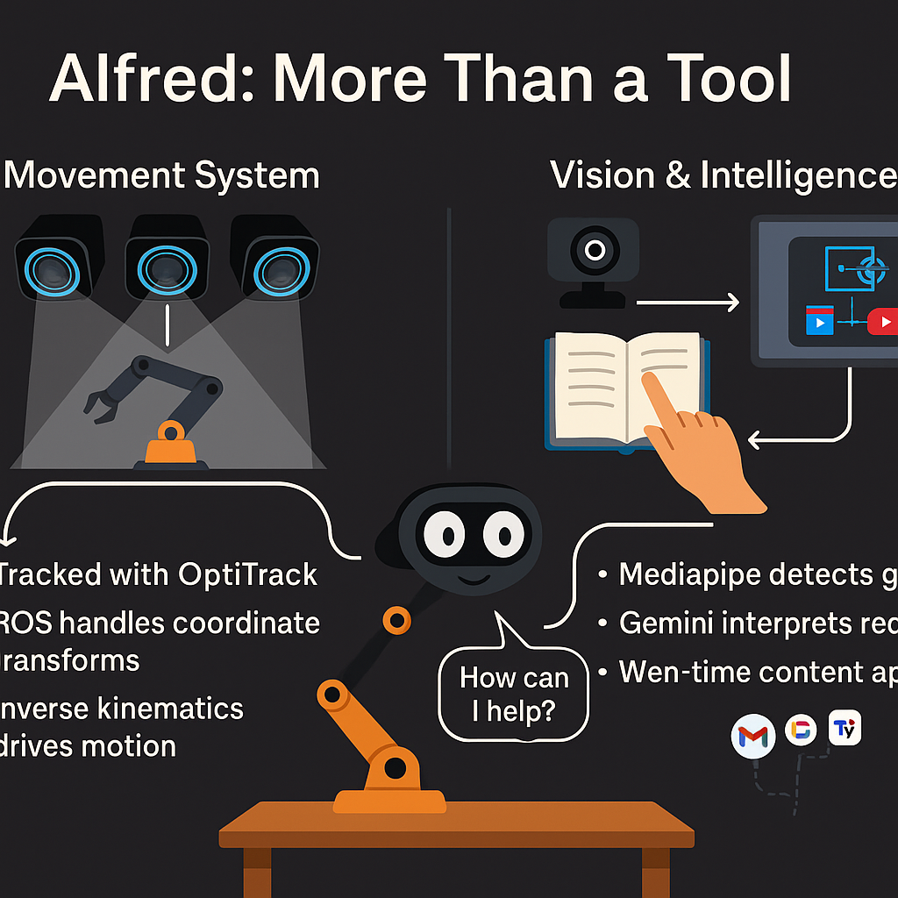
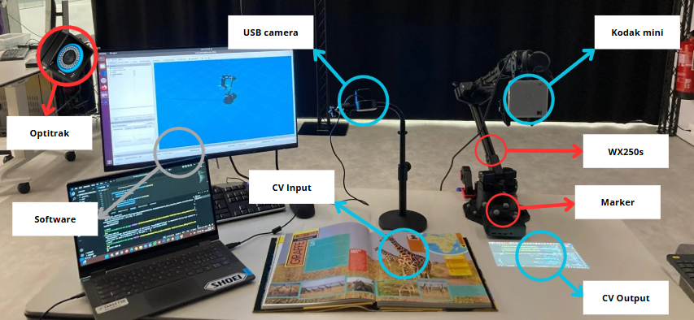
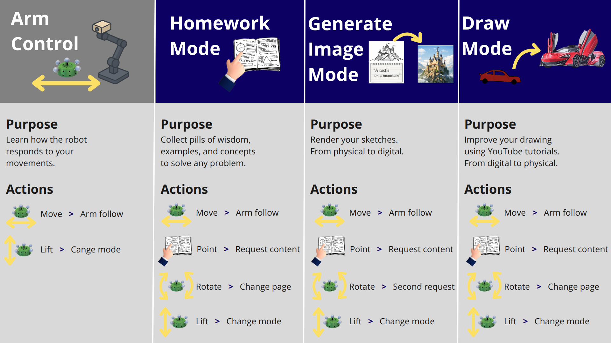

<h1 align="center">🤖 AIfred – Your Clever Robotic Study Companion</h1>

<p align="center">
  
</p>

<p align="center">
  AIfred is an interactive robotic lamp designed to enhance your learning experience. It responds to hand gestures, retrieves real-time information, and seamlessly blends digital and physical spaces using computer vision and AI. Built with ROS, Mediapipe, and Gemini API, it turns study time into an intuitive and focused conversation.
</p>

<p align="center">
  📺 <b>Watch the full demo on YouTube:</b><br>
  <a href="https://www.youtube.com/watch?v=L3PLWqSPDGM">
    <br>
    https://www.youtube.com/watch?v=L3PLWqSPDGM
  </a>
</p>


## Intro

This project introduces AIfred, a Clever Lamp, and innovative robotic lighting system designed to be the perfect companion for users. The system features a WX250s robotic arm from Trossen Robotics, equipped with a Kodak Mini projector mounted on its end-effector. The Clever Lamp combines advanced robotics with customizable projection capabilities, creating a versatile and interactive lighting solution.

The robotic arm's precise movements allow the projector to illuminate and transform the surrounding environment with tailored images and videos. Users can effortlessly manipulate the lamp's position and projection content, offering a unique and personalized lighting experience. The simplicity of the 3D design ensures ease of use and installation, while the customization options open up a wide range of applications, from mood lighting and entertainment to educational and professional uses.

By integrating cutting-edge robotics with user-centric design, the Clever Lamp offers immense potential for creative and practical applications, making it an indispensable addition to modern living spaces.

The objective of the project is to have a friend and tool at the disposal of the user. With a simple webcam, AIfred can detect what is appening on the user workspace and provide with usefull insights such as YouTube videos and Wikypedia links. Moreover, AIfred will be able to see your workspace intercat with you with voice (speech-to-speech) and solve on paper math for you.

<br>

The agent has 3 intelligent modes:

- HOMEWORK - Project examples, wisdome pills, and explanations to help you with your homework, and learning process.

- GENERATE IMAGE - Render sketches, diagrams, or hand drawings from phisical space to digital space, and project them on the table.

- DRAW - Draw on paper with the robot arm projecting alligned youtube videos to improve your drawing skills.

## Before running the code

To run the code you will need some prerequisites:

1. Optitrack system: It is a system of camares that detect position and orientation of cetain objects thank to capability of reflection of the ball markers.
2. Install [natnet_ros_cpp](https://github.com/L2S-lab/natnet_ros_cpp) ros package to send messages from Optitrack to your `roscore`.
2. Install [interbotics_ws](https://docs.trossenrobotics.com/interbotix_xsarms_docs/ros_interface/ros1/software_setup.html) ros package to move and nteract wth wx250s robot arm from trossenrobotics.
3. 3D print our [universal marker](https://github.com/IERoboticsAILab/3d_printing_designs/blob/main/files/optitrack/Universal_Marker_3.stl). It is an object that will be easily detected from Optitrack. We call it `umh_0`.
4. 3D print our [custom wx250s base](https://github.com/IERoboticsAILab/3d_printing_designs/blob/main/files/WX-250_robot_garden/base/bottom_base_WX-250_for%20Optitrack.stl), for the robot arm. It has M3 scrues to host marker balls in place and detect position of robot base. We call it `real_base_wx250s`.

<br>

## AIfred USAGE (Ros Package)

#### Hardware set-up

1. Setup:
    <div align="center">
    
    </div>
2. Take Trossenrobotics wx250s, and secure it on table. Connect it to his power supply and connect signal USB to the computer.
3. Mount Kodak Projector on the end-effector of the Trossenrobotics Robot arm (wx250s) (download [this](https://github.com/IERoboticsAILab/3d_printing_designs/blob/main/files/WX-250_robot_garden/support_projector_wx250s.stl) for the attachment).
4. Attach chromcast to the HDMI of the kodak projector mini and power with a USB from chromcast to projector.
5. Connect a USB camera to PC and make it point on your working station.
6. Turn on optitrack:

    **a.** Turn on rigid body for mark base robot (download [here](https://github.com/IERoboticsAILab/3d_printing_designs/blob/main/files/WX-250_robot_garden/base/bottom_base_WX-250_for%20Optitrack.stl) `real_base_wx250s`)

    **b.** Turn on rigid body for universal marker (download [here](https://github.com/IERoboticsAILab/3d_printing_designs/blob/main/files/optitrack/Universal_Marker_3.stl)`umh_0`)


#### Install software

1. Create a Gemini API and YouTube API and put them in a `.env` file

2. Download [natnet_ros_cpp](https://github.com/L2S-lab/natnet_ros_cpp) ROS package

3. Downlaod [Trossenrobotics ROS Pakages](https://docs.trossenrobotics.com/interbotix_xsarms_docs/ros_interface/ros1/software_setup.html) (our guide [here](https://github.com/IERoboticsAILab/wx250s_documentation))

4. Download AIfred ROS Package:

    ```
    cd ~/catkin_ws/src
    git clone https://github.com/IERoboticsAILab/clever_lamp.git
    cd ..
    catkin build  #OR catkin_make
    . devel/setup.bash
    ```
5. Open chrome (better account with youtube premium) tab (will be used for casting YouTube videos)

6. Open FireFox tab (will be used for wikipedia articles)

7. Cast the tab of chrome with chromcast that is on the robot arm end effector Kodak Projector

8. Create virtual environment and download all the dependencies for computer vision 

```bash
uv sync
```

#### Run demo

```
roslaunch alfred_clever_lamp demo.launch
```

##### Step by step instructions
The launch file will execute all the necessary nodes to have the full demo running, but if you want to run it step by step, here you have the instructions:

1. Publishing messages from Optitrack to ros:

    ```
    roslaunch natnet_ros_cpp gui_natnet_ros.launch
    ```
    OR
    ```
    roslaunch natnet_ros_cpp natnet_ros.launch serverIP:=10.205.3.3 clientIP:=10.205.3.150 pub_rigid_body:=true pub_rigid_body_marker:=true serverType:=unicast
    ```

    <div align="center">
    
    </div>

    - Check that the topics have been published using:

      ```
      rostopic list
      ```

      If NOT, change from *Multicast* to *Unicast* (and viceversa) and press *start* again untill the messages are published

2. Connect to Trossenrobotics Robot Arm. Source the interbotix workspace and run the controll package:
    ```
    source interbotics_ws/devel/setup.bash
    roslaunch interbotix_xsarm_control xsarm_control.launch robot_model:=wx250s
    ```

3. Make robot follow and point on the marker.

    a. `brodcast marker`: This section of the project combine digital space wit real word with a user frendly interface. In RViz the robot is set in (0,0,0) that is the word cordinate space. But in the reality the robot is in a diffrent position in space (it depends where you position the working table). Here we take the Optitrack cordinates of the real robot base (`/natnet_ros/real_base_wx250s/pose`) in relation with the real marker (`/natnet_ros/umh_2/pose`), and we transform that relation with the digital robot base (`wx250s/base_link`), publishing a new tf for the marker (`umh_2_new`)

    b. `clever lamp`: Look at the tf transformation of the universal marker position relative to the digital space and move end effector accordingly.

4. Run the computer vision ROS Node:
    a. `computer vision`: Look at the webcam, detect using mediapipe if you are pointing at something with your finger, take screenshot and shows YouTube video and Wikipedia of what you are looking at. If it detect some math, it solve it step by tep with you, projecting on the paper the solution. To run this script you will need to create a virtual environment with all the dependencies and activate it when launching the alfred node (point at things → webcam → gemini → video casted).


### Usage



1. Move the Universal Marker and the robot will follow pointing the projector content on the table.

4. Point on the workspace with your finger to trigger the screenshot, that will pass to Gemini API, and generate Personalize Content for you. Then it will be projected on the table.

3. Rotate the marker to show next/previous YouTube video.

4. Lift TUI to go to the next mode

## Resources

- [Kodak Projector mini 75](https://www.amazon.es/Proyector-ultraport%C3%A1til-pulgadas-recargable-integrado/dp/B078NCG82N/ref=sr_1_1_sspa?__mk_es_ES=%C3%85M%C3%85%C5%BD%C3%95%C3%91&crid=3S9FWZSE5RNKX&dib=eyJ2IjoiMSJ9.O8ucHWBeDVklyy4E2G41tBv8Ia-koCQlhFK2-Gaa-sfu27Qibdr6sjtje2vBBshUx0CzYE6RjgCFtxasghLWDDIU2orVaDq9UBfuy8Fgbt6y-cD9T7YY4B4xmdCXQINHssZoAu0IbHls-0fcyCdUTBtkNML2p2IcDDLb16Sl-fBh9IGZmtBXrpvIQOudGI3tpmXbGAN9PZPQL42tDny_-oY1NeIJ1Qwu9Nog4Lcj6VHFwG8UjK0ffjWMBQBGJ1QhjWz8JBp1HbcoFbzwWYb2BXxU-_6vTjoVKsnuKYXFLrc.HbABcLTElT1qpDQNPyOYGagCEX3jk-Wce0fHaSc58V8&dib_tag=se&keywords=kodak+projector&qid=1716604099&sprefix=kodak+projector%2Caps%2C132&sr=8-1-spons&sp_csd=d2lkZ2V0TmFtZT1zcF9hdGY&psc=1)
- [kodak manual pdf](demos/kodak_manual.pdf)
- [natnet_ros_cpp](https://github.com/L2S-lab/natnet_ros_cpp) ROS package
- [interbotics_ws](https://docs.trossenrobotics.com/interbotix_xsarms_docs/ros_interface/ros1/software_setup.html) ROS package
